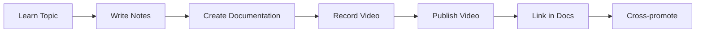
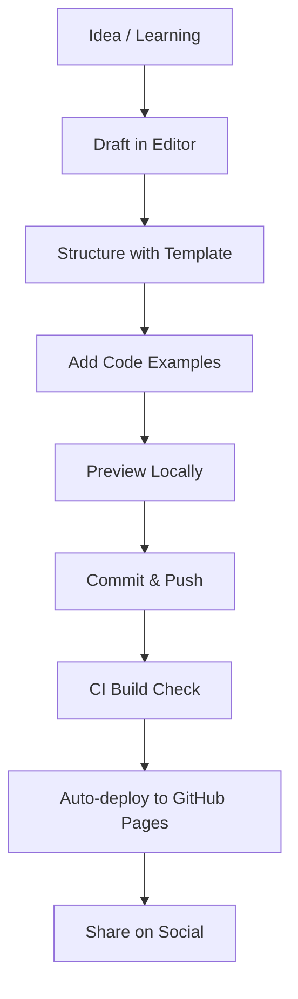

# :material-star: Best Practices Guide

> **Strategies for maintaining this platform as both a personal knowledge base and a public engineering portfolio.**

---

## :material-briefcase: Recruiter Optimisation

### What Recruiters and Hiring Managers Look For

1. **Depth of Knowledge** — Detailed, well-structured content on core technologies shows mastery
2. **Practical Experience** — Projects with real architecture diagrams and source code
3. **Consistency** — Regular updates signal active learning and engagement
4. **Communication** — Clear, well-written documentation demonstrates communication skills
5. **Breadth** — Coverage across DevOps, Cloud, and ML shows versatility

### Optimisation Actions

- Keep the **homepage** as a clear portfolio landing page with skills and project highlights
- Ensure every **project page** has an architecture diagram, tech stack, and GitHub link
- Maintain **status badges** to show what is active vs planned
- Add **certifications** section when relevant (CKA, AWS SAA, etc.)
- Include a **downloadable resume** link in the footer or about section

---

## :material-shield-check: Professional Credibility

### Building Trust Through Content

| Action | Impact |
|---|---|
| Write detailed technical posts | Shows depth of understanding |
| Include production war stories | Demonstrates real-world experience |
| Show code alongside explanations | Proves hands-on capability |
| Reference official documentation | Shows professional rigour |
| Acknowledge limitations and trade-offs | Builds trust and maturity |

### What to Avoid

- Generic, surface-level content that adds no value
- Copy-pasted content without personal insight
- Outdated information with no update notes
- Broken links or incomplete pages
- Over-promising on "coming soon" content

---

## :fontawesome-brands-youtube: YouTube Growth Integration

### Content Pipeline

### YouTube Strategy

1. **Every course module should have a companion video** — link it in the page header
2. **Use documentation as video scripts** — ensures consistency between written and video content
3. **Add timestamps in video descriptions** linking back to doc sections
4. **Create playlists** matching the course structure
5. **Promote the docs site in every video** — "full written guide at learning.vishal-connect.com"

### Thumbnail and Branding

- Consistent thumbnail template across all videos
- Match the color palette of the documentation site
- Include topic name and difficulty level in thumbnails

---

## :material-head-lightbulb-outline: Interview Preparation Efficiency

### Spaced Repetition System

1. **First pass** — Read through all Q&A for a topic
2. **Day 2** — Review only the questions you couldn't answer
3. **Day 7** — Full review of the topic
4. **Day 30** — Quick revision before interviews
5. **Pre-interview** — Focus on company-specific preparation

### Study Schedule

| Week | Focus |
|---|---|
| 1 | Core DevOps concepts + Linux |
| 2 | CI/CD + Containers |
| 3 | Kubernetes deep dive |
| 4 | Cloud (AWS/Azure) |
| 5 | System design + behavioral |
| 6 | Company-specific + mock interviews |

---

## :material-brain: Learning Retention Systems

### The Documentation-First Learning Method

1. **Read/Watch** — Consume learning material
2. **Practice** — Hands-on labs and exercises
3. **Document** — Write it in your own words in the portal
4. **Teach** — Record a YouTube video explaining it
5. **Review** — Revisit and refine periodically

> *"If you can't explain it simply, you don't understand it well enough."*

### Knowledge Compounding

- Each new topic should **link back** to previously learned concepts
- **Cheatsheets** serve as quick-recall reinforcement
- **Projects** combine multiple topics into applied knowledge
- **Interview prep** tests understanding from a different angle

---

## :material-calendar: Consistency Strategy

### Publishing Cadence

| Content Type | Frequency |
|---|---|
| Course modules | 2-3 per week |
| Blog posts | 1-2 per month |
| YouTube videos | 1-2 per week |
| Cheatsheet updates | Monthly |
| Project updates | Bi-weekly |

### Avoiding Burnout

- Batch content creation — write 3-4 pages in one session
- Repurpose content — docs become videos, videos become blog posts
- Set realistic goals — quality over quantity
- Take scheduled breaks — consistency ≠ every single day

---

## :material-book-open: Content Publishing Workflow

---

## :material-trophy: Authority Building

### Establishing Technical Authority

1. **Consistent, high-quality output** — publish regularly with depth
2. **Contribute to open source** — link contributions from the portfolio
3. **Speak at meetups/conferences** — add speaking engagements section
4. **Write on multiple platforms** — cross-post to Medium, Dev.to, Hashnode
5. **Engage in communities** — Reddit, Discord, Stack Overflow
6. **Get certified** — CKA, AWS SAA, Terraform Associate add credibility

### Consulting Brand Positioning

- Position yourself as a **specialist**, not a generalist
- Lead with **DevOps + MLOps** as a unique combination
- Showcase **architecture-level thinking** in projects
- Include **case studies** with anonymised client outcomes
- Offer a clear **services page** if pursuing consulting

---

## :material-target: Career Growth Summary

!!! success "The Formula"
    **Learn → Practice → Document → Record → Publish → Portfolio**

    This creates a flywheel effect:

    - Learning creates skills
    - Documentation creates proof
    - Videos create audience
    - Portfolio creates opportunities
    - Interviews become easier
    - Career grows faster
