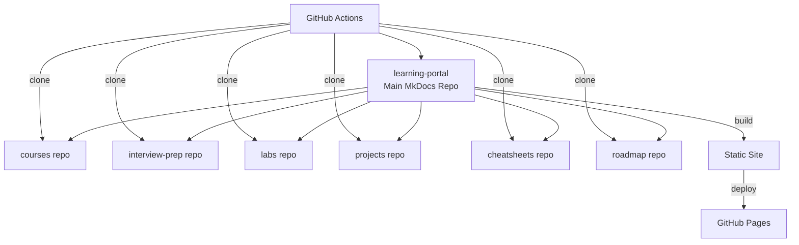
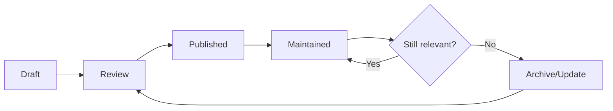

# :material-chart-line: Scalability & Architecture Guide

> **Senior-architect-level recommendations for maintaining and scaling this documentation platform over years.**

---

## :material-source-branch: Multi-Repository Content Strategy

### Current Architecture



### Scaling Recommendations

1. **Repository Boundaries** — Each repo should be independently deployable and testable. Keep shared assets (CSS, JS, overrides) only in the learning-portal repo.

2. **Git Submodules Alternative** — Consider replacing the `git clone` approach with Git submodules for tighter version control across repos. This enables pinning specific versions of content repos.

3. **Monorepo Option** — If the multi-repo approach becomes burdensome (>10 repos), consider consolidating into a monorepo with CODEOWNERS and path-based permissions.

---

## :material-file-tree: Content Governance Framework

### Page Templates

Standardise all content pages using templates:

| Content Type | Template Elements |
|---|---|
| **Course Module** | Title, description, tags, learning objectives, content, exercises, YouTube link, next/prev navigation |
| **Lab** | Title, difficulty, duration, prerequisites, objective, steps, validation, cleanup |
| **Project** | Title, architecture diagram, tech stack, implementation guide, source code link, lessons learned |
| **Interview Q&A** | Title, question format (admonition), answer with code examples, related topics |
| **Cheatsheet** | Title, categorised command blocks, no prose — pure reference |
| **Roadmap** | Title, phases with Mermaid diagrams, status indicators, time estimates |

### Content Quality Checklist

Every page should pass this before publishing:

- [ ] Front matter complete (title, description, tags)
- [ ] Proper heading hierarchy (single H1, nested H2-H4)
- [ ] Code blocks have language specified
- [ ] Internal links use relative paths
- [ ] Status badge is current
- [ ] No broken links
- [ ] Reviewed for technical accuracy

---

## :material-tag: Tagging Strategy

### Tag Taxonomy

| Category | Tags |
|---|---|
| **Technology** | `linux`, `docker`, `kubernetes`, `terraform`, `ansible`, `aws`, `azure`, `gcp` |
| **Domain** | `devops`, `mlops`, `aiops`, `sre`, `platform-engineering`, `devsecops` |
| **Content Type** | `course`, `lab`, `project`, `cheatsheet`, `interview`, `roadmap` |
| **Level** | `beginner`, `intermediate`, `advanced` |
| **Status** | `live`, `in-progress`, `planned` |

### Rules

- Every page must have at least one technology tag and one content type tag
- Keep tags lowercase with hyphens
- Maximum 7 tags per page

---

## :material-history: Versioning Strategy

### Content Versioning

- Use **Git tags** for major content releases (e.g., `v2026.1`, `v2026.2`)
- Maintain a **CHANGELOG.md** in each repo for significant updates
- Use the `git-revision-date-localized` plugin to show last-updated timestamps

### MkDocs Versioning

- When the platform grows significantly, implement **mike** (MkDocs versioning tool) to maintain multiple versions
- This allows readers to access previous versions of content

---

## :material-text-box-check: Architecture Decision Records (ADR)

### ADR Template

```markdown
# ADR-001: [Decision Title]

## Status
Accepted | Superseded | Deprecated

## Context
What is the issue that we're seeing that is motivating this decision?

## Decision
What is the change that we're proposing and/or doing?

## Consequences
What becomes easier or more difficult to do because of this change?
```

### Recommended ADRs to Create

1. **ADR-001:** Multi-repo vs monorepo content architecture
2. **ADR-002:** MkDocs Material vs alternative documentation frameworks
3. **ADR-003:** GitHub Pages vs Cloudflare Pages vs Netlify deployment
4. **ADR-004:** Content tagging and categorisation strategy
5. **ADR-005:** YouTube integration approach

---

## :material-robot: Automation Opportunities

| Automation | Tool | Priority |
|---|---|---|
| **Link checking** | `markdown-link-check` in CI | High |
| **Spell checking** | `cspell` in CI | Medium |
| **Image optimisation** | `sharp` / `imagemin` in CI | Medium |
| **Dead code detection** | Custom script to find unreferenced pages | Medium |
| **Auto-formatting** | `prettier` for Markdown | Low |
| **SEO validation** | Custom meta tag checker | Low |
| **Broken nav detection** | `mkdocs build --strict` | High |
| **Dependency updates** | Dependabot / Renovate | Medium |

---

## :material-account-group: Contributor Workflow

### For Solo Maintenance

1. Write content in your preferred editor (VS Code, Obsidian)
2. Preview locally with `docker compose up`
3. Commit to a feature branch
4. Push and verify CI build passes
5. Merge to main → auto-deploy

### For Future Contributors

1. Fork the relevant content repo
2. Create a feature branch
3. Follow the page template for the content type
4. Submit PR with description of changes
5. Automated CI checks (links, build, formatting)
6. Review and merge

---

## :material-refresh: Content Lifecycle Management



### Review Schedule

| Content Type | Review Frequency |
|---|---|
| Courses | Quarterly |
| Cheatsheets | Bi-annually |
| Interview Prep | Monthly |
| Projects | When tech stack changes |
| Roadmaps | Annually |
