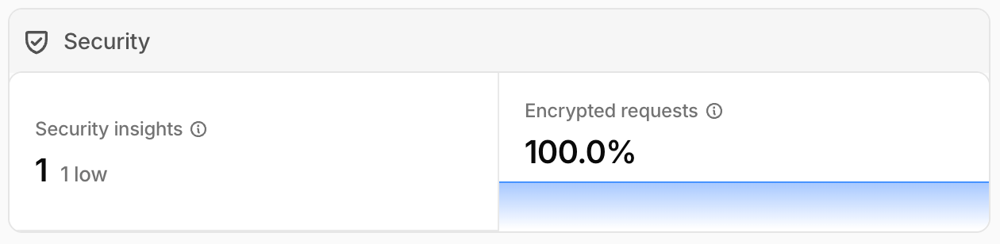
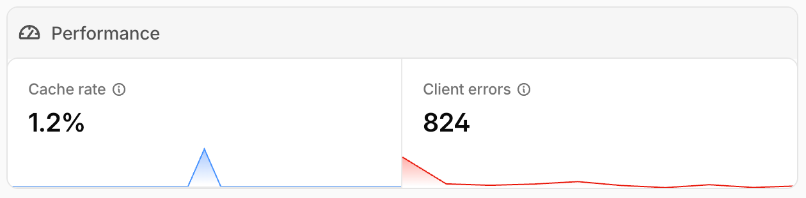
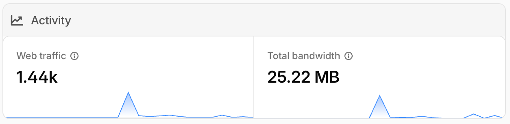

# 🖼️ Ways to Add Images in MkDocs
## Basic Markdown (Most Common)



## Multiple Images (Stacked)





## Tools and Technology

<div class="grid cards cols-3" markdown>

- [:material-linux: **Linux**](courses/linux/index.md){ .course-link .course-title }<br>
  :material-clock-outline: **Status:** <span class="course-status">Coming Soon</span>

??? abstract "[View Topics](courses/linux/index.md){ .course-link .course-title }"
    Covers essential Linux administration concepts including:

    - Introduction
    - File System

</div>

---

<div class="icon-toolbar" markdown>

[:material-folder-eye:](https://github.com "View example"){ .course-link } 
[:material-folder-download:](files/course.zip "Download example file"){ .course-link }
[:material-folder-zip-outline:](files/course.zip "ZIP"){ .course-link } 

</div>

---

## Install curl

=== "Debian / Ubuntu"

    ```bash
    sudo apt update
    sudo apt install -y curl
    ```

    Verify:

    ```bash
    curl --version
    ```

=== "RHEL / CentOS / Fedora"

    ```bash
    sudo dnf install -y curl
    ```

    > For older systems:
    ```bash
    sudo yum install -y curl
    ```

    Verify:

    ```bash
    curl --version
    ```


=== "macOS"

    #### Using Homebrew (Recommended)

    ```bash
    brew install curl
    ```

    #### Default (Pre-installed)

    ```bash
    curl --version
    ```

---

## Example Usage

```bash
curl https://example.com
```

---

[Hover me](https://example.com "I'm a tooltip!")

---

<div class="tooltip" markdown>

[:material-linux: **Linux Course**](courses/linux/index.md)

<div class="tooltip-content">

<!-- <b>Course Modules</b> -->

• Introduction  
• File System  
• User Group Management  
• Permissions  
• Process Management  
• Package Management  
• Networking  
• SSH  
• Security  
• Shell Scripting  

</div>

</div>

---

### Example Script
<div class="icon-toolbar" markdown>

[:material-folder-eye:](https://github.com "View example"){ .course-link } 
[:material-folder-download:](files/course.zip "Download example file"){ .course-link }
[:material-folder-zip-outline:](files/course.zip "ZIP"){ .course-link } 

</div>
```bash
--8<-- "test.sh"
```

---

[:material-download: Download Script](scripts/install-docker.sh){ .md-button }
[:material-file-code: install-docker.sh](scripts/install-docker.sh)

---

### Docker Installation Script

[:material-download: Download Script](scripts/install-docker.sh)

```bash title="install-docker.sh"
--8<-- "./test.sh"
```